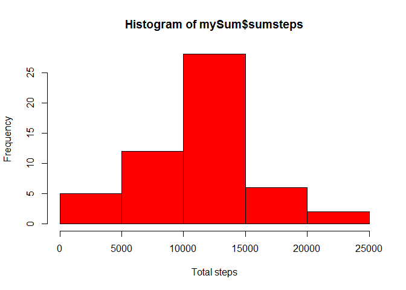
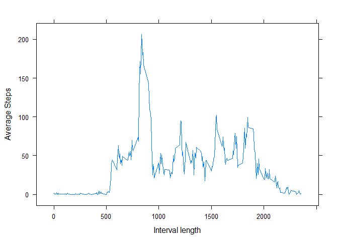
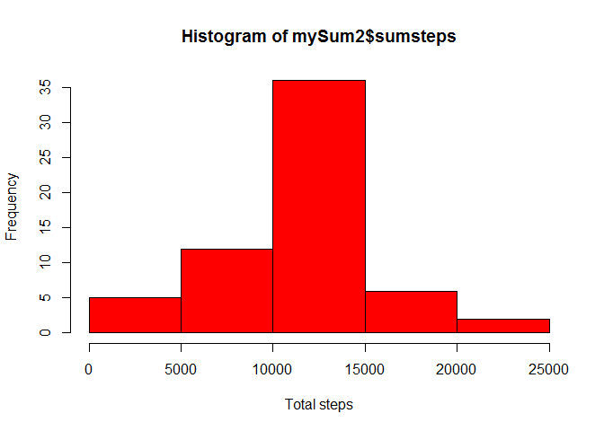
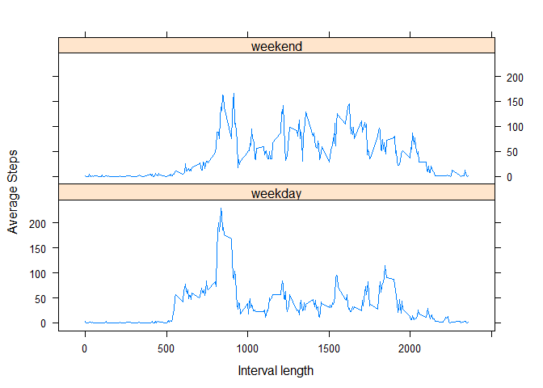

# Reproducible Research: Peer Assessment 1

##Getting ready
The following code loads some of the libaries used in the project, namely `dplyr` to transform data and `lattice` for the lattice plotting system.


```r
library(dplyr)
```

```
## 
## Attaching package: 'dplyr'
```

```
## The following objects are masked from 'package:stats':
## 
##     filter, lag
```

```
## The following objects are masked from 'package:base':
## 
##     intersect, setdiff, setequal, union
```

```r
library(lattice)
```

## Loading and preprocessing the data

To start the explorative analysis the data in `activity.csv` is loaded into the `myData` data frame.

```r
unzip("activity.zip", overwrite = TRUE)
myData<-read.csv("activity.csv")
```

Next the data in the column `date` is converted into the `Date` datatype using the `as.Date` function.

```r
myData$date<-as.Date(myData$date,"%Y-%m-%d")
```

The data is now ready for analysis and processing.

##What is the mean total number of steps taken per day?
First we answer the question what the total number of steps per day taken is.
For that we use the `%>%` operator to chain a few `dplyr` package commands together. We first group the data by the date and then sum the steps for each day and store the result in the `mySum` data frame.

```r
mySum <- myData %>% group_by(date) %>% summarise(sumsteps=sum(steps))
```

With the data in `mySum` we can draw a histogram of the `sumsteps`

```r
hist(mySum$sumsteps, col="red", xlab="Total steps", ylab="Frequency")
```

<!-- -->

Furthermore we can calcuate both the mean and the median of the data set by ensuring to ignore `NA` values with the `na.rm = TRUE` option.


```r
mean(mySum$sumsteps,na.rm = TRUE)
```

```
## [1] 10766.19
```

```r
median(mySum$sumsteps,na.rm = TRUE)
```

```
## [1] 10765
```

##What is the average daily activity pattern?
Next we analyze the average daily activity pattern. We use the tools of `dplyr` and the `%>%` command to calculate the average steps per interval by ignoring the `NA` values. The result is stored in data frame `myAvgSteps`.
We use `xyplot` from the `lattice` package to plot the average steps over the interval length as line plot.

```r
myAvgSteps <- myData %>% group_by(interval) %>% summarise(avgSteps=mean(steps,na.rm=TRUE))
xyplot(avgSteps ~ interval, data=myAvgSteps, type="l", xlab="Interval length", ylab="Average Steps")
```

<!-- -->

Next we find the maximum average daily activity interval.

```r
myAvgSteps[which.max(myAvgSteps$avgSteps),]
```

```
## # A tibble: 1 x 2
##   interval avgSteps
##      <int>    <dbl>
## 1      835 206.1698
```

##Imputing missing values
Before imputing missing values in the data set we calculate the number of records in the daat set that have `NA` for the steps column.

```r
sum(is.na(myData$steps))
```

```
## [1] 2304
```

The startegy to impute the missing values is to take the mean of all records of the same interval accross all days and replace the `NA` value with the mean of that group.
For that we first copy the data frame `myData` to a new data frame `myData2`.
Next we use the function `ave` to calculate the average per group defined by the variable `interval` while ignoring the `NA` values. We assign the group-wise calculated mean of `NA` steps rows in the dataset to the `steps` variable with `NA` values.

```r
myData2<-myData
myData2$steps[is.na(myData2$steps)]<-ave(myData2$steps,myData2$interval,FUN=function(x) mean(x,na.rm = TRUE))[is.na(myData2$steps)]
```

Next we repeat the calculation of the total number of steps by grouping the new dataset by date. We use the newly calculated sum in data frame `mySum2` to recreate a histogram as before and recalulate both mean and median.

```r
mySum2 <- myData2 %>% group_by(date) %>% summarise(sumsteps=sum(steps))
hist(mySum2$sumsteps, col="red", xlab="Total steps", ylab="Frequency")
```

<!-- -->

```r
mean(mySum2$sumsteps,na.rm = TRUE)
```

```
## [1] 10766.19
```

```r
median(mySum2$sumsteps,na.rm = TRUE)
```

```
## [1] 10766.19
```

We see that the histogram changes in having a higher frequency in the median. The mean and the median are now the same value. The imputing of the data has lead to the dataset be more 'compacted' towards the median. We can also see this by calculating the standard deviation from before imputing and after. The standard deviation of the data set after imputing is smaller than before.

```r
sd(mySum$sumsteps,na.rm = TRUE)
```

```
## [1] 4269.18
```

```r
sd(mySum2$sumsteps,na.rm = TRUE)
```

```
## [1] 3974.391
```

##Are there differences in activity patterns between weekdays and weekends?
Finally we add a factor variable to the new data set `myData2` to indicate the weekday or weekend of the date. we add a factor with two levels and store it in the variable `wd`. We set the default variable to `weekday` and find all instance of the data where the `weekdays` function returns `Saturday` or `Sunday` and set the `wd` to `weekend`.

```r
myData2$wd<-factor(c("weekday","weekend"))
myData2$wd="weekday"
myData2[(weekdays(myData2$date)=="Saturday") | (weekdays(myData2$date)=="Sunday"),4]<-"weekend"
```

With this data we now use the `dplyr` tools to group the data by `wd` and `interval` and calculate the average steps per group before using `xyplot` from the `lattice` paqckage to plot a panel plot of average steps over interval lengths grouping teh data by the factor of weekday/weekend.

```r
myAvgSteps2 <- myData2 %>% group_by(wd, interval) %>% summarise(avgSteps=mean(steps,na.rm=TRUE))
xyplot(avgSteps ~ interval | wd, data=myAvgSteps2, layout=c(1,2), type="l", xlab="Interval length", ylab="Average Steps")
```

<!-- -->

This concludes the anaylses for this project.
